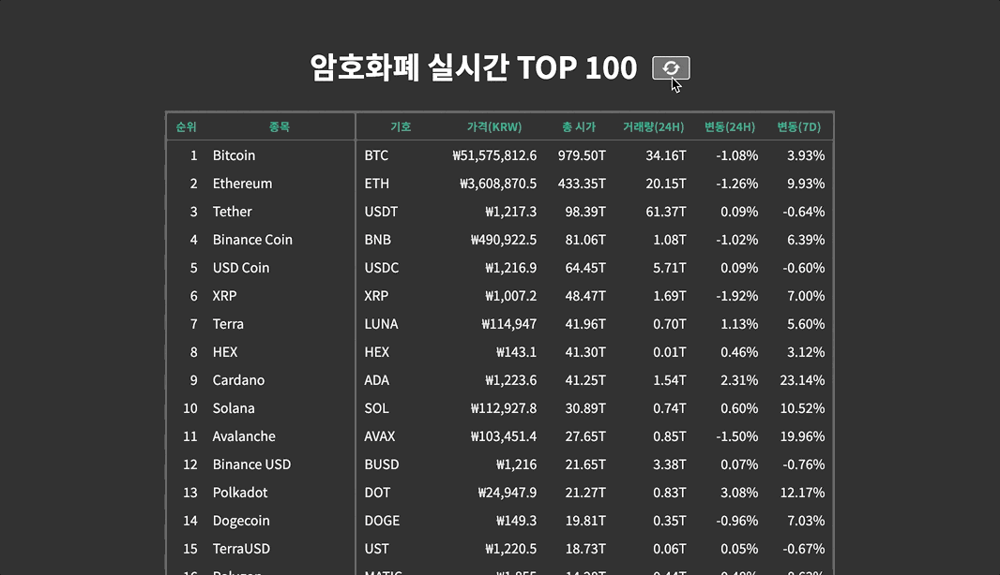

# 암호화폐 실시간 시세 (Coin Tracker)

📎 [Demo](https://fromnowwon.github.io/coin/)

<br/>



<br/>

## Introduction
- 1위부터 100위까지 암호화폐 실시간 시세 정보를 출력하는 페이지입니다.
- API : [coinpaprika](https://api.coinpaprika.com/)

<br/>

## Development Environment
- Client: React, TypeScript, SCSS

<br />

## Tree
```
coin-tracker
├── public
│   ├── images
│   └── index.html
├── src
│   ├── components
│   │   └── App.tsx
│   ├── App.scss
│   ├── index.scss
│   └── index.tsx
├── README.md
├── package-lock.json
├── package.json
└── tsconfig.json
```